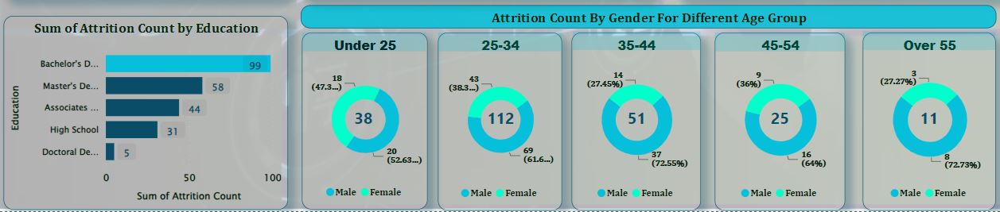

# Human_Resource_Dashboard_Visualization
This Human Resource Dashboard focuses on employee attrition rate of an organization over a specific period

Each objective on every Human Resource’s strategic plan should have associated quantifiable HR metrics to measure HR's success. In addition, Setting KPIs in human resources is key to getting the most out of a company’s human capital and meeting the strategic objectives of the HR department.

This Human Resource Dashboard focuses on employee turnover rates over a specific period. The upper section highlights the KPIs, including attrition rate, attrition count, and active employees. Below it are metrics related to department, age group, gender, job satisfaction rate, etc., giving an entire vision of the different areas within HR.

.

After data analysis and visualization have been done, there are 1470 Total employees, of which 1233 are active; this gives an Attrition Count of 237 and an Attrition Rate of 16.12%. This rate implies that 16 out of every 100 employees have left the organization. 

Also, significantly high attrition rate were observed in the R&D department (56.12%), among staff with a bachelor's degree educational qualification (41.77%), and also in the age group 25–34 (47.25%), which definitely draws the attention of the organization to these cohorts.

Knowing that some sectors have lower or higher attrition rates, e.g., insurance >15%, oil & gas <15%, technology > 20%, etc., an attrition rate of 10-15% would allow for the continuous evolution of skills and capability and the departure of those not performing within the organization. Some common causes of staff attrition include personal reasons, career promotion, redundancy, termination, relocation, etc.

However, a high attrition rate can present some challenges to an organization, which can lead to more stress in the workplace. In addition, engaged and productive employees are the key to any successful business, so when an employee leaves the company, it can have damaging effects on productivity and profits.

Therefore, a better understanding of the underlying themes behind the attrition rate calculations can ensure you are well prepared to manage challenges for any employees who may leave in the future.
